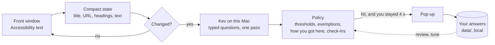

<p align="center"></p>

<h1 align="center">Qualm</h1>

<p align="center"><b>A second thought before the scroll.</b><br>
Qualm reads your screen on your Mac, with a local model, and steps in when you drift into<br>
endless short video, feeds or livestreams. It stays out of the way when you're learning, working, or looking something up.</p>

<p align="center"></p>

## Why another blocker

Blocking sites gets desktops wrong. YouTube is a lecture and a Shorts feed. Reddit is the thread
that fixes your error, and r/popular after it. Block the domain and you lose the lecture; allow
it and you get the feed. So Qualm doesn't block sites. It **blocks the mechanism**: the endless
scroll, the feed that picks for you, the stream with no end. It leaves the tool alone.

| | Usually fine | Usually the trap |
|---|---|---|
| YouTube | a lecture, a repair tutorial you searched for | the home page, Shorts, the autoplay after it |
| Reddit | the thread Google found for your error | r/popular, then the next thread |
| Bilibili | 宋浩高数, a course playlist | the home feed, 鬼畜 clips, live rooms |
| X / Weibo | a thread someone sent you | For You, 热搜 |

Qualm tells the two apart from what's on screen and **how you got there**. A thread opened from a
search is on purpose. The fifth thread opened from a feed is drift.

## What it does

- **Reads the front window as text** through the macOS Accessibility API: title, address,
  headings, some visible text. For an app that draws its text as pixels (a video player, a
  canvas), it reads the window with macOS's own text recognition instead, never for windows
  where you type. With the local model, nothing leaves the Mac.
- **Asks a local model typed questions** ([Kev](https://github.com/jaredpalmer/kev), an open
  "System One" model on Qwen3.5-4B, running on Apple silicon with MLX). What kind of page is
  this? Is it for learning, a task, or entertainment? Is it private? Does it break each of your
  rules, and how likely is that? One pass, about 0.6 s.
- **Decides in plain code.** Per-rule thresholds, and exemptions for learning material, work
  tools, search, private pages and things opened on purpose. Check-in sessions, pauses, and what
  you taught it.
- **Steps in gently.** A dark, blurred panel dims the screen and says why; until you answer, clicks
  behind it don't go through (switch that off in the menu bar). *Take me back* is the
  default: it goes back off the site (to the lecture before the Shorts, not the next feed), or to
  a new tab if there's nothing to go back to. *I need it* unlocks after a short wait that grows each time you use it, and each
  time you come back after going back, and asks what for. The wording changes now and then, on purpose, so it doesn't turn
  into wallpaper. *Not this one* teaches the rule an exception, and *Never here* silences an app or site.
- **Checks in instead of counting a daily budget.** For entertainment video and social media,
  it asks on arrival: what are you here for, and for 5, 15 or 30 minutes? Then it stays quiet
  until that time is up, and *Done* takes you back. Each session today makes the next one wait
  a little longer, up to a minute. It never blocks. [docs/POLICY.md](docs/POLICY.md) says why
  daily budgets were the wrong design.

<p align="center">


</p>

### Focus sessions

Say what you're here to do: *write the pitch deck, 50 minutes*. Until the session ends, every rule
steps in at once, and the pop-up reminds you of your own words instead of a rule. Start one from
the menu bar, the dashboard, or `qualm focus write the pitch deck`. In a session, the first
step-in is a small note in the corner that leaves your keyboard alone; the full pop-up comes if
you're still there 20 seconds later.

<p align="center">


</p>

### A dashboard that doesn't scold

Open it at `http://127.0.0.1:8765`. It shows how each pop-up ended, when in the week they happen,
what you unlocked time for (in your words), your focus sessions, check-ins (what you said and what you did), and one question a
week: *was that time worth it?* It has no score and no streaks. Review tells Qualm where it was
wrong, with the closest calls first, and your answers retune the thresholds.

<p align="center"></p>

<details><summary>Today and Rules, light and dark</summary>
<p align="center">


</p>
<p align="center"><sub>Screenshots from <code>experiments/demo_data.py</code>: made-up weeks, not anyone's browsing.</sub></p>
</details>

## How it works



- **It asks only when the screen changes.** A new page gets a question after 0.5 s. Changed text
  on the same page is asked about at most every 30 s. Answers are cached by exactly what the
  model read, and 92% of real calls had been re-asks.
- **Rules are sentences, not site lists.** "Short videos made for endless swiping" works on a site
  nobody listed. Sites and URL patterns are there for what must always count.
- **Everything is a command**, so you can personalize it from a terminal, or have Claude Code do it
  ([.claude/skills/qualm](.claude/skills/qualm/SKILL.md)): `qualm rules add news --what "news
  articles and headlines" --check-in`, then `rules test`, `rules label` and `rules tune`.
  [docs/PERSONALIZE.md](docs/PERSONALIZE.md) covers all of it.

## Get started

**The app.** Build it (below) or take a `Qualm.dmg`, drag Qualm to Applications and open it. A short setup
asks four things:

1. **Where the model runs.** *On this Mac* (Kev-4B, 8-bit): private, about 1 s per check; it uses 6–7 GB of
   memory while it runs, and the first start downloads about 9 GB, once. *Hosted* (TypeSafe's Jev): about
   0.2 s and almost no memory, but the text of each new screen is sent to TypeSafe; it needs an API key,
   which is kept in your keychain. Setup recommends one from what your Mac has free right now, counting
   what's swapped out.
2. **Accessibility**, so Qualm can read the front window. Without it, it sees only app names.
3. **What to watch for**: the starter rules, each on or off.
4. **Open at login.**

Your rules and data live in `~/Library/Application Support/Qualm`. The app starts the local model itself
and stops it when you quit. From the menu bar you can switch the model, turn each rule on or off, pause,
and start a focus session. Hosted Jev costs about $0.02–0.06 a workday at TypeSafe's early-access price; [docs/MODELS.md](docs/MODELS.md)
compares the two: speed, memory, disk, cost and what leaves the Mac. The app is ad-hoc signed, not notarized: on a Mac that didn't build it, the
first open needs right-click → Open ([packaging/README.md](packaging/README.md)).

**From source** (a Mac with Apple silicon and [uv](https://docs.astral.sh/uv/); tested on macOS 27, M5 Pro, 24 GB):

```bash
git clone <this repository> qualm && cd qualm
uv sync
uv run qualm setup                     # the same four questions, in the terminal
uv run qualm app                       # the menu bar app (it starts the model server itself)
uv run python packaging/build_app.py   # or build dist/Qualm.app and dist/Qualm.dmg
```

`qualm doctor` says what's missing and how to fix it. `qualm app --demo` shows the pop-up without
watching anything (also: feed, checkin, timesup, focus, prompt). A checkout from before September 23
kept `rules.toml` and `data/` in its own folder: `qualm setup` copies them to Application Support.

| Everyday | |
|---|---|
| `qualm focus write the report --minutes 50` | a focus session; `--stop` ends it |
| `qualm pause 30` | leave me alone for 30 minutes; `--stop` resumes |
| `qualm rules list` | your rules, in sentences |
| `qualm rules add NAME --what "…"` | a new rule in your words; then `rules test NAME` |
| `qualm status` | is it running, what did it judge last |
| `qualm review --web` | the dashboard, if the app isn't running |

## How well it works

These are honest numbers, with their caveats. The trial set is **119 pages opened by a script and
labelled by what was opened** (logged out, browser only). It's easier than real life, so treat it
as a first filter, not a verdict. The details are in [HANDOFF.md](HANDOFF.md), under Measured.

| Rule | Precision | Recall | Without URL patterns (a site nobody listed) |
|---|---|---|---|
| short video | 1.00 | 1.00 | 1.00 / 0.77 |
| feeds | 1.00 | 0.60 | 1.00 / 0.60 |
| livestreams | 1.00 | 1.00 | 1.00 / 1.00 |
| entertainment video (check-in) | 1.00 | 0.83 | 1.00 / 0.83 |
| social media (check-in) | 0.88 | 0.70 | 0.88 / 0.70 |

This is the whole policy (thresholds, exemptions, patterns), with each page judged cold.

- **Speed:** about 0.6 s per reading with 5 rules, on this Mac, warm. The model answers every
  question in one forward pass, so up to about 10 rules cost the same as one.
- **Memory:** about 6 GB for Kev-4B at 8 bits. On the trial pages it gives the same answers as
  bf16, which needs 11 GB. 0.8B is fast but too weak.
- **Weak spots:** Twitch shows no "live" text, which is why livestreams have URL patterns. X
  profiles and stock-forum lists read as single items, not feeds. Kev ranks pages well but its
  scores run low, so thresholds are per rule and low (0.15–0.5).

## The research it leans on

- **one sec** ([PNAS 2023](https://www.pnas.org/doi/10.1073/pnas.2213114120)): the option to back
  out and a short delay reduced use; a reflective message on its own did not. Hence *Take me back*
  as the default and a wait before *I need it*.
- **Time2Stop** ([CHI 2024](https://arxiv.org/abs/2403.05584)): saying *why* an intervention fired
  raised its accuracy and how well people took it. Hence the reason line, and the check of which
  part of the screen carried the signal.
- **Goal reminders and implementation intentions**
  ([Lyngs et al., CHI 2020](https://arxiv.org/abs/2001.04180);
  [Gollwitzer & Sheeran](https://psycnet.apa.org/record/2007-19538-002)): hence focus sessions
  that echo your own words, and "what's it for?" echoed back when the time is up.
- **Screen-time dashboards and guilt** ([WellScreen, CHI 2026](https://arxiv.org/abs/2509.21860)):
  hence no score and no streaks, and one question about whether the time was worth it.

## Privacy

- With the local model, the page text is read, judged and logged on your Mac only, in
  `~/Library/Application Support/Qualm`.
- Private pages (logins, payments, banking) are not judged, not logged with content (only the
  site's name, so a mistake can be found), and no screenshot of them is kept. Judgements are kept
  90 days and screenshots 30 (`keep_days`, `keep_shots_days`); `qualm uninstall --all` removes
  everything Qualm wrote. Password managers are never read at all, and you can add any app to that list.
- The dashboard listens on 127.0.0.1 only, and only the page itself can change settings.
- The hosted option, TypeSafe's Jev, is yours to choose in setup, never a fallback: if the local model
  is down, Qualm doesn't quietly switch to it. With it, the text of each new screen goes to TypeSafe;
  the log stays on your Mac.

## Status

This is an early, working prototype: a Python + PyObjC menu bar app, used by its author since September 2026. The
`.app` is ad-hoc signed, not notarized, and each rebuild asks for Accessibility again. It has no OCR fallback, so apps that
draw their text as pixels are judged by their title alone. [HANDOFF.md](HANDOFF.md) has the full
state, the design decisions and the next steps.

Qualm is a desktop take on **SeeNot**, an Android research app from SUSTech. It's built on
[Kev](https://github.com/jaredpalmer/kev) and TypeSafe's System One API.
