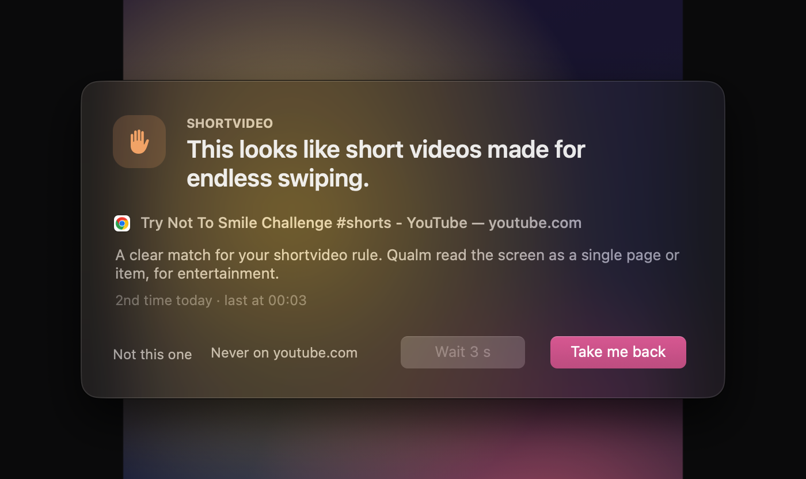
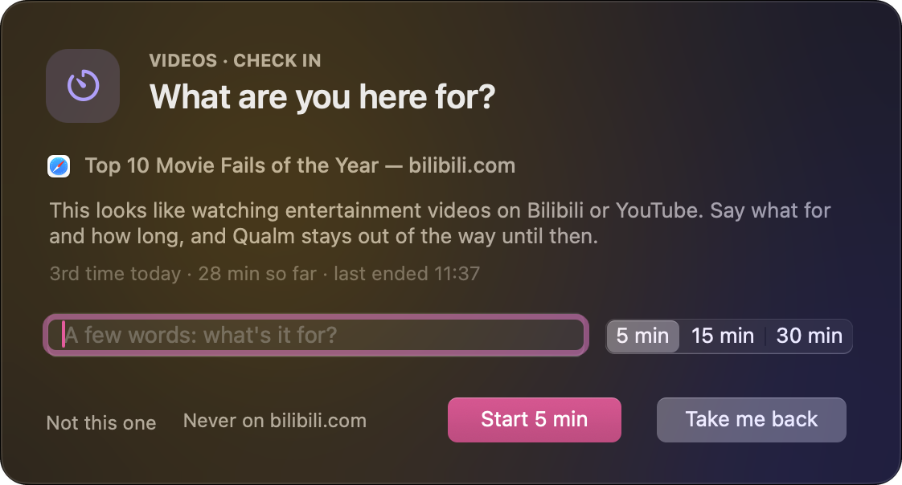
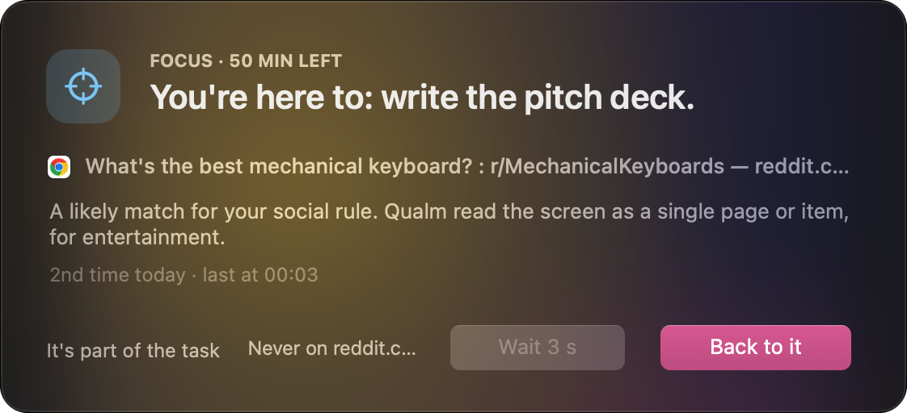

<p align="center"></p>

<h1 align="center">Qualm</h1>

<p align="center"><b>The first screen-time app built on Kev and Jev.<br>
Local-first on Apple silicon Macs.</b></p>

<p align="center">A second thought before the scroll. Qualm reads your screen and steps in when you drift into
endless short video, feeds or livestreams, and stays out of the way when you're learning or working.</p>

<p align="center"><a href="https://qualm.r-q.name">Website</a> ·
<a href="https://github.com/RoderickQiu/qualm/releases">Download</a> ·
<a href="docs/MANUAL.md">Manual</a></p>

<p align="center"></p>

## Why Kev and Jev

A blocker sees a site. But YouTube is a lecture and a Shorts feed, and Reddit is the thread that
fixes your error and r/popular after it. Block the site and you lose the lecture; allow it and you
get the feed.

[Kev](https://github.com/jaredpalmer/kev) and TypeSafe's
[Jev](https://typesafe.ai/blog/introducing-system-one-models-and-jev) are "System One" models: they answer
typed questions about a text, all in one pass, with a calibrated probability on each. So on every new screen Qualm asks what kind of page
it is, whether it's for learning, work or entertainment, whether it's private, and how likely it
breaks each of your rules. Plain code decides from there. The lecture stays; the Shorts get a pop-up.

Your rules are sentences, not site lists: "short videos made for endless swiping" catches a site
nobody listed.

## Local-first

| | Kev, on your Mac (default) | Jev, hosted |
|---|---|---|
| Model | [Kev-4B, 8-bit for MLX](https://huggingface.co/RoderickQiu/kev-4b-mlx-8bit), Apache-2.0 | [Jev 1.13](https://typesafe.ai/blog/introducing-system-one-models-and-jev), TypeSafe's API |
| Each check | about 1 s | about 0.2 s |
| What leaves the Mac | nothing | the text of each new screen, to TypeSafe |
| Needs | M1 or later, macOS 14, 6–7 GB of memory free | a TypeSafe API key, about $1 a month |

With Kev, the app does the rest: it downloads the model and its runtime once (about 6 GB), starts
it, and stops it when you quit. No Python, no terminal, no account. Jev is yours to pick in setup,
never a fallback: if the local model is down, Qualm doesn't quietly switch to the hosted one.

## What it does

- **A pop-up that says why.** *Take me back* is the default; *I need it* opens after a short wait.
- **Check-ins, not daily budgets.** For videos and social media it asks what you're there for, and
  for 5, 15 or 30 minutes, then stays quiet.
- **Focus sessions** that remind you of your own words.
- **A dashboard with no score and no streak.** Your answers tune the thresholds.
- **Rule changes through your AI agent** (Claude Code, Codex, Cursor), which can test each change
  on your own recent screens first.

<p align="center">


</p>

## Get started

Download `Qualm.dmg` from [Releases](https://github.com/RoderickQiu/qualm/releases), drag Qualm to
Applications and open it. It isn't notarized yet, so macOS blocks the first open: click *Open
Anyway* in System Settings > Privacy & Security. Setup asks four things: where the model runs,
Accessibility, which rules to start with, and whether to open at login.

From source, with [uv](https://docs.astral.sh/uv/):

```bash
git clone https://github.com/RoderickQiu/qualm && cd qualm
uv sync
uv run qualm setup
uv run qualm app
```

## How well it works

On 119 trial pages, with Kev on the Mac, the short video, feeds, livestream and video rules never
stepped in where they shouldn't have (precision 1.00; social media 0.88). The trial set is easier
than real life; the numbers and their caveats are in the [manual](docs/MANUAL.md), under How well
it works.

## More

- [Website](https://qualm.r-q.name): the pop-up, the check-in and the decision, live in the browser
- [Manual](docs/MANUAL.md): setup in full, permissions, commands, privacy, the numbers
- [Kev or Jev](docs/MODELS.md): speed, memory, cost, and what leaves the Mac
- [Changing rules](docs/PERSONALIZE.md) · [Why check-ins, not daily budgets](docs/POLICY.md) ·
  [Design notes and status](HANDOFF.md)

Qualm is an early prototype, used by its author since September 2026: Apple silicon only, English
interface, rules in any language. It's a desktop take on
[SeeNot](https://github.com/RoderickQiu/seenot-app), an Android research app from SUSTech.

Qualm is free software under the [GNU GPL v3](LICENSE) or any later version.
