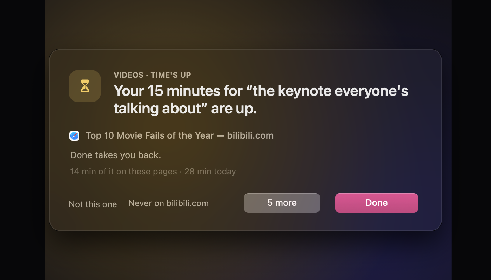
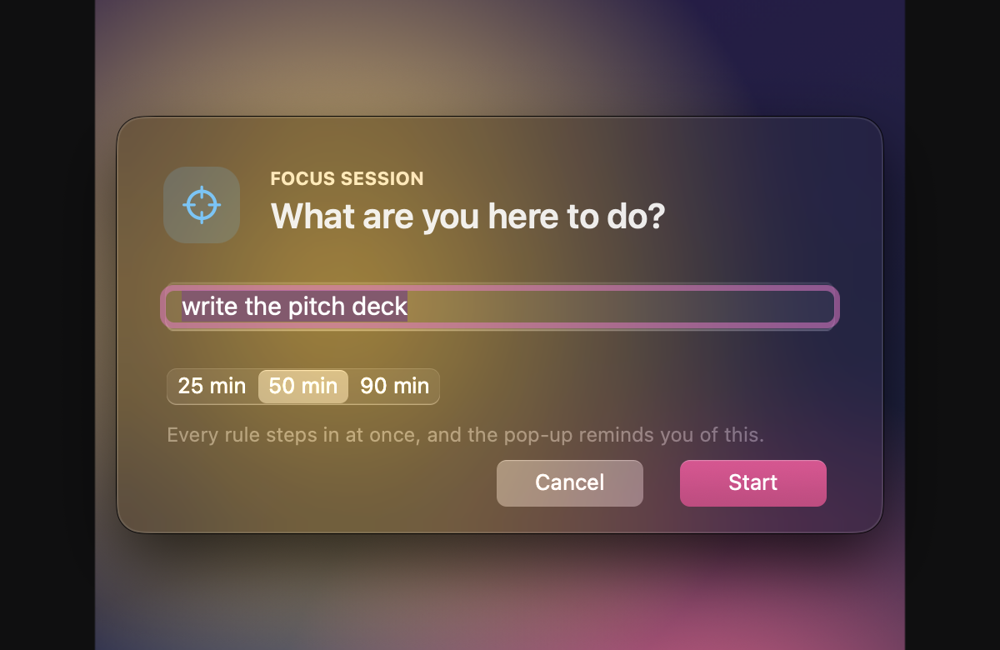
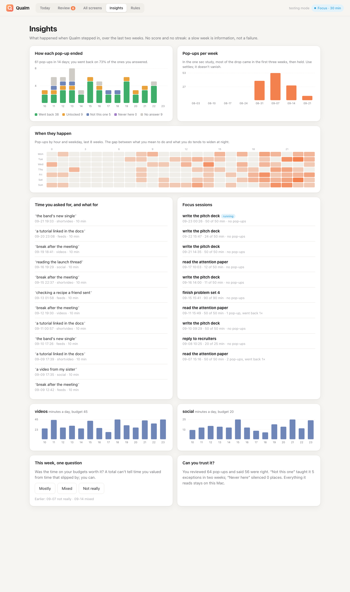
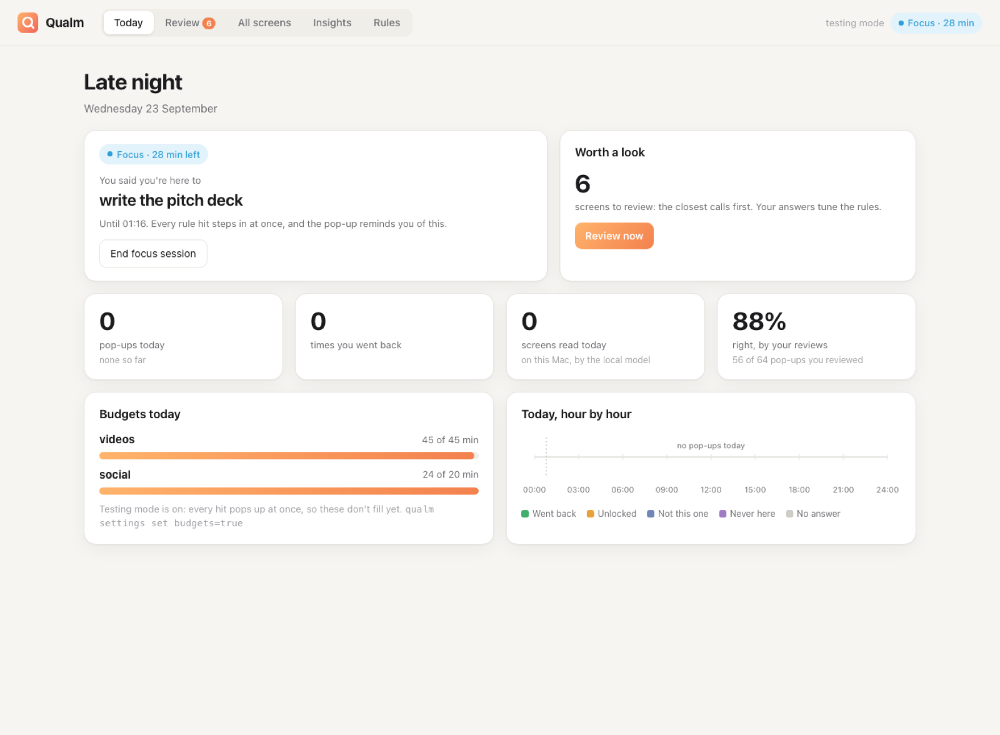
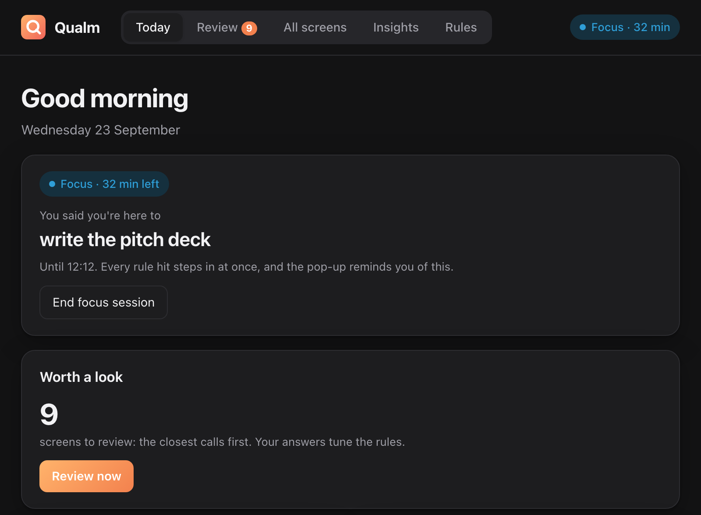
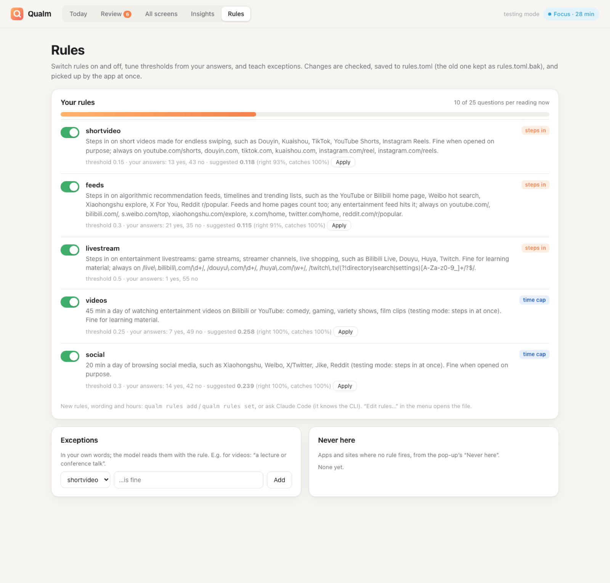
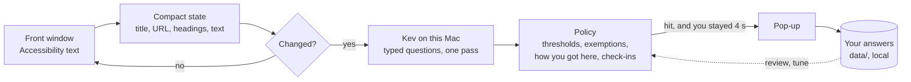

<p align="center"></p>

<h1 align="center">Qualm</h1>

<p align="center"><b>A second thought before the scroll.</b><br>
Qualm reads your screen on your Mac, with a local model, and steps in when you drift into<br>
endless short video, feeds or livestreams. It stays out of the way when you're learning, working, or looking something up.</p>

<p align="center"></p>

## Why another blocker

Blocking sites gets desktops wrong. YouTube is a lecture and a Shorts feed. Reddit is the thread
that fixes your error, and r/popular after it. Block the domain and you lose the lecture; allow
it and you get the feed. So Qualm doesn't block sites. It **blocks the mechanism**: the endless
scroll, the feed that picks for you, the stream with no end. It leaves the tool alone.

| | Usually fine | Usually the trap |
|---|---|---|
| YouTube | a lecture, a repair tutorial you searched for | the home page, Shorts, the autoplay after it |
| Reddit | the thread Google found for your error | the home feed, r/popular, then the next thread |
| Instagram / Facebook | a friend's post someone sent you | the home feed, Reels |
| Bilibili | 宋浩高数, a course playlist | the home feed, 鬼畜 clips, live rooms |
| X / Weibo | a thread someone sent you | For You, 热搜 |

Qualm tells the two apart from what's on screen and **how you got there**. A thread opened from a
search is on purpose. The fifth thread opened from a feed is drift.

## What it does

- **Reads the front window as text** through the macOS Accessibility API: title, address,
  headings, some visible text. For an app that draws its text as pixels (a video player, a
  canvas), or a browser that shows Accessibility no page (Firefox with its accessibility off), it
  reads a picture of the window with macOS's own text recognition instead (this needs Screen
  Recording), never for windows where you type. With the local model, nothing leaves the Mac.
- **Asks a local model typed questions** ([Kev](https://github.com/jaredpalmer/kev), an open
  "System One" model on Qwen3.5-4B, running on Apple silicon with MLX). What kind of page is
  this? Is it for learning, a task, or entertainment? Is it private? Does it break each of your
  rules, and how likely is that? One pass, about 1 s.
- **Decides in plain code.** Per-rule thresholds, and exemptions for learning material, work
  tools, search, private pages and things opened on purpose. Check-in sessions, pauses, and what
  you taught it.
- **Steps in gently.** A dark, blurred panel dims the screen and says why; until you answer, clicks
  behind it don't go through (switch that off in the menu bar). *Take me back* is the
  default: it goes back off the site (to the lecture before the Shorts, not the next feed), or to
  a new tab if there's nothing to go back to (one step back in a browser Qualm doesn't know), and
  never closes a browser window;
  in an app, it closes the window (a photo opened from a chat) or, if that's the only one, hides the app. *I need it* unlocks after a short wait that grows each time you use it, and each
  time you come back after going back, and asks what for. The wording changes now and then, on purpose, so it doesn't turn
  into wallpaper. *Not this one* lets that page's address through (in an app, that window, below the score it had), and *Never here* silences an app or site
  for every rule (undo it on the dashboard's Rules tab). On a rule's own sites and apps those two wait
  as long as *I need it* does.
- **Checks in instead of counting a daily budget.** For entertainment video and social media,
  it asks on arrival: what are you here for, and for 5, 15 or 30 minutes? Then it stays quiet
  until that time is up, and *Done* takes you back. Each session today makes the next one wait
  a little longer, up to a minute. It never blocks. [docs/POLICY.md](docs/POLICY.md) says why
  daily budgets were the wrong design.

<p align="center">


</p>

### Focus sessions

Say what you're here to do: *write the pitch deck, 50 minutes*. Until the session ends, every rule
steps in at once, and the pop-up reminds you of your own words instead of a rule. Start one from
the menu bar, the dashboard, or `qualm focus write the pitch deck`. In a session, the first
step-in is a small note in the corner that leaves your keyboard alone; the full pop-up comes if
you're still there 20 seconds later.

<p align="center">


</p>

### A dashboard that doesn't scold

Open it from the menu bar (*Open dashboard*); it's at `http://127.0.0.1:8765` unless another
program holds that port (AnkiConnect does), and then `qualm status` says where. It shows how each pop-up ended, when in the week they happen,
what you unlocked time for (in your words), your focus sessions, check-ins (what you said and what you did), and one question a
week: *was that time worth it?* It has no score and no streaks. Review tells Qualm where it was
wrong, with the closest calls first, and your answers retune the thresholds. A chip at the top
says when Qualm isn't running, can't read windows, can't reach its model, or has hosted trouble (no
key, a key turned down, the usage limit). The Rules tab says each rule's address patterns in words ("certain pages of twitch.tv and
kick.com"), the regexes one click away. After an update, a tab left open reloads itself.

<p align="center"></p>

<details><summary>Today and Rules, light and dark</summary>
<p align="center">



</p>
<p align="center"><sub>Screenshots from <code>experiments/demo_data.py</code>: made-up weeks, not anyone's browsing.</sub></p>
</details>

## How it works



- **It asks only when the screen changes.** A new page gets a question after 0.5 s. Changed text
  on the same page is asked about at most every 30 s. Answers are cached by exactly what the
  model read, and 92% of real calls had been re-asks.
- **Rules are sentences, not site lists.** "Short videos made for endless swiping" works on a site
  nobody listed. Sites and URL patterns are there for what must always count. Naming sites in
  the sentence narrows it: worded "entertainment videos on Bilibili or YouTube", the video rule
  let Netflix and Vimeo through (scores 0.12-0.15 on the local model); without the names they
  check in (0.50-0.67).
- **Change rules with your AI agent, not by hand.** Rules are sentences a small model reads, and
  wording that reads right can make it worse: on a real Mac, an exception naming WeChat, WhatsApp
  and iMessage made the social rule flag WhatsApp more (~0.17 → ~0.50). So every change is a
  command that can be scored on your own recent screens first (`rules test`, `allow test`), and an
  agent that runs commands (Claude Code, Codex, Cursor) does that for you. In the menu bar,
  *Change rules with your AI agent…* copies a prompt for it, with the pop-ups you recently said were
  wrong; the agent runs `qualm guide` and takes it from there. Say "WeChat chats aren't social
  media" and it measures an allow class for chats before saving it. On the first day there's
  nothing to measure on yet: it saves the rule with a first guess, says so, and checks it once
  you've used the Mac for a day. [docs/PERSONALIZE.md](docs/PERSONALIZE.md) covers the commands.

## Get started

Qualm needs a Mac with Apple silicon (M1 or later). The model on the Mac needs macOS 14 or later;
the hosted one works from macOS 13. Its interface is in English; your rules can be in any language.

**The app.** There's no published download yet: build `Qualm.dmg` (below), or take one someone built.
Drag Qualm to Applications and open it from there, not from the disk image. It's ad-hoc signed, not
notarized, so on a Mac that didn't build it macOS blocks the first open: go to System Settings >
Privacy & Security and click *Open Anyway* (since macOS 15, right-click > Open no longer does it;
[packaging/README.md](packaging/README.md)). A short setup asks four things:

1. **Where the model runs.** *On this Mac* (Kev-4B, 8-bit): private, about 1 s per check; it uses 6–7 GB of
   memory while it runs, and the first start downloads about 6 GB (the model and its runtime), once. The
   menu bar icon is an arrow while it downloads (the menu says how far it is) and an hourglass while it
   loads, and a download that gets cut off goes on where it stopped. *Hosted*
   (TypeSafe's Jev): about 0.2 s and almost no memory, but the text of each new screen is sent to
   TypeSafe. It needs a TypeSafe account and API key ([console.typesafe.ai](https://console.typesafe.ai)),
   kept in your keychain, and costs about $1 a month at TypeSafe's early-access price. Setup recommends
   one from what your Mac has free right now, counting what's swapped out.
2. **Accessibility**, so Qualm can read the front window. Without it, it sees only app names.
   **Screen Recording** (on macOS 15 and later, *Screen & System Audio Recording*) is optional: with
   it, Qualm can read windows that draw their text as pixels (the picture is read on the Mac and not
   kept) and the dashboard shows screenshots.
3. **What to watch for**: the starter rules, each on or off.
4. **Open at login.**

Later, macOS may ask once more: the first *Take me back* in Chrome, Brave, Edge, Arc or another
Chromium browser asks to let Qualm control that browser; in Safari, to control Safari (to read the
address) and System Events (which presses Back); in Firefox and other browsers, to control System
Events (**Automation**). Allow it, or *Take me back* can't go back there.

Your rules and data live in `~/Library/Application Support/Qualm`. The app starts the local model itself
and stops it when you quit. From the menu bar you can switch the model (*Model*; picking hosted asks
for a key), turn each rule on or off, pause, and start a focus session. A badge on the eye and a first
menu line mean something stops Qualm working, such as a missing permission or a hosted key that was
turned down; click the line for the fix. A mistake in `rules.toml` shows the same way, and Qualm
keeps watching meanwhile: with the rules it last loaded, or, when it starts, with the version it
last saved (else an earlier saved version, else the starter rules), until the file is fixed (your
AI agent, or `qualm config undo` when there's a version to go back to). Until then it never reads
the apps that file lists as not to be read, and on the hosted model it sends nothing to TypeSafe:
only a rule's own sites and apps step in. Only one Qualm runs at a time: a second copy, or one
started while an older Qualm runs, says so and quits. To update, quit Qualm from its menu first,
then update, then open it again.
[docs/MODELS.md](docs/MODELS.md) compares the two models: speed, memory, disk, cost and what leaves
the Mac.

If huggingface.co is blocked where you are, the local model can't download: point it at a mirror with
`qualm settings set hf_endpoint=https://hf-mirror.com`, and put mirrors for its Python packages in
`~/.config/uv/uv.toml` (`index-url`, `python-install-mirror`). That file can't redirect the runtime's
Kev archive on GitHub: where GitHub is blocked, run `QUALM_KEV_ARCHIVE=<a copy of
https://github.com/jaredpalmer/kev/archive/08ab0b87d27cb5577a3b371ad7ed4e4686b0502b.zip> qualm serve`
once in a terminal, and the app uses that runtime from then on.

**From source** (Apple silicon and [uv](https://docs.astral.sh/uv/); tested on macOS 27, M5 Pro, 24 GB):

```bash
git clone <this repository> qualm && cd qualm
uv sync
uv run qualm setup                     # the same four questions, in the terminal
uv run qualm app                       # the menu bar app (it starts the model server itself)
uv run python packaging/build_app.py   # or build dist/Qualm.app and dist/Qualm.dmg (needs the Command Line Tools)
```

Run from a checkout, Qualm reads windows as your terminal app, so macOS asks for Accessibility (and
Screen Recording) for the terminal. Setup's *start at login* defaults to no here, since the login item
needs the same permissions for its own Python; if you turn it on, setup starts Qualm at once and you
skip `qualm app`. To type plain `qualm` anywhere, `uv tool install --editable .`, or alias it to
`uv run --project /path/to/qualm qualm`. Qualm.app adds `~/.local/bin/qualm`; if that folder isn't
on your PATH, setup prints the line to add.

`qualm doctor` says what's missing and how to fix it. `qualm app --demo` shows the pop-up without
watching anything (also: feed, checkin, timesup, focus, prompt). A checkout from before September 23
kept `rules.toml` and `data/` in its own folder: `qualm setup` copies them to Application Support.

| Everyday | |
|---|---|
| `qualm focus write the report --minutes 50` | a focus session; `--stop` ends it |
| `qualm pause 30` | leave me alone for 30 minutes (`2h`, `--until 'mon 09:00'`, or on a weekday the coming weekend: `--from 'sat 00:00' --until 'mon 09:00'`); `--stop` resumes and cancels a planned one |
| `qualm rules list` | your rules, in sentences |
| `qualm rules add NAME --what "…"` | a new rule in your words; then `rules test NAME` |
| `qualm status` | is it running, which model, what did it judge last |
| `qualm week` | how this week went |
| `qualm review --web` | the dashboard, if the app isn't running |

## How well it works

These are honest numbers, with their caveats. The trial set is **119 pages opened by a script and
labelled by what was opened** (logged out, browser only). It's easier than real life, so treat it
as a first filter, not a verdict. The details are in [HANDOFF.md](HANDOFF.md), under Measured.

| Rule | Precision | Recall | Without URL patterns (a site nobody listed) |
|---|---|---|---|
| short video | 1.00 | 1.00 | 1.00 / 0.77 |
| feeds | 1.00 | 0.60 | 1.00 / 0.60 |
| livestreams | 1.00 | 1.00 | 1.00 / 1.00 |
| entertainment video (check-in) | 1.00 | 0.83 | 1.00 / 0.83 |
| social media (check-in) | 0.88 | 0.70 | 0.88 / 0.70 |

This is the whole policy (thresholds, exemptions, patterns), with each page judged cold, on the
local model.

The trial pages come from one person's habits (Bilibili, Douyin, Weibo, YouTube). So the starter
rules were also run on 73 made-up pages the trials never had (Netflix, Vimeo, Kick, Facebook,
Instagram, Threads, lectures, work tools; in English, Chinese, Japanese and German). They stepped
in on 25 of the 26 pages they should have (hosted Jev; on the local model, 16 of the 17 it scored),
and on 1 of the 30 pages that should be left alone: a live coding stream on Twitch, which the Twitch
pattern catches (locally, a Netflix documentary also got a check-in). The trial results held with
this wording: the same pages pop up, on all 119 hosted and on those nearest a threshold locally.

- **Speed:** about 1 s per reading with 5 rules on an M5 Pro with memory to spare (0.6 s warm and
  alone), 3–20 s when the Mac is swapping; hosted, about 0.2 s. The model answers every
  question in one forward pass, so up to about 10 rules cost the same as one.
- **Memory:** about 6 GB for Kev-4B at 8 bits. On the trial pages it gives the same answers as
  bf16, which needs 11 GB. 0.8B is fast but too weak.
- **Weak spots:** Twitch shows no "live" text, which is why livestreams have URL patterns, and
  why a coding stream there pops up too (*Not this one* lets that one address through, *Never
  here* all of Twitch). X
  profiles and stock-forum lists read as single items, not feeds. Kev ranks pages well but its
  scores run low, so thresholds are per rule and low (0.15–0.5). The two models don't always
  agree on pages outside the trial set (pop-up or not differed on 5 of 53), mostly on whether a
  page is a feed.

## The research it leans on

- **one sec** ([PNAS 2023](https://www.pnas.org/doi/10.1073/pnas.2213114120)): the option to back
  out and a short delay reduced use; a reflective message on its own did not. Hence *Take me back*
  as the default and a wait before *I need it*.
- **Time2Stop** ([CHI 2024](https://arxiv.org/abs/2403.05584)): saying *why* an intervention fired
  raised its accuracy and how well people took it. Hence the reason line, and the check of which
  part of the screen carried the signal.
- **Goal reminders and implementation intentions**
  ([Lyngs et al., CHI 2020](https://arxiv.org/abs/2001.04180);
  [Gollwitzer & Sheeran](https://psycnet.apa.org/record/2007-19538-002)): hence focus sessions
  that echo your own words, and "what's it for?" echoed back when the time is up.
- **Screen-time dashboards and guilt** ([WellScreen, CHI 2026](https://arxiv.org/abs/2509.21860)):
  hence no score and no streaks, and one question about whether the time was worth it.

## Privacy

- With the local model, the page text is read, judged and logged on your Mac only, in
  `~/Library/Application Support/Qualm`.
- Private pages (logins, payments, banking) are not acted on, not logged with content (only the
  site's name and score, so a mistake can be found), and no screenshot of them is kept. A
  screenshot is kept only when the model read the page and didn't find it private. Judgements are
  kept 90 days and screenshots 30 (`keep_days`, `keep_shots_days`). `qualm uninstall --all` removes
  what Qualm wrote. It leaves the model's Hugging Face downloads, which other tools may share, and
  prints the command that removes them; uv's cache, and any Python it downloaded for the local
  model, stay too (`uv cache clean` empties the cache).
- Password managers (Apple Passwords, 1Password, Bitwarden, KeePassXC and others) are never read
  at all, whatever the settings say, and you can add any app to that list (`no_monitor`).
- The dashboard listens on 127.0.0.1 only, and only the page itself can change settings.
- The hosted option, TypeSafe's Jev, is yours to choose in setup, never a fallback: if the local model
  is down, Qualm doesn't quietly switch to it. With it, the text of each new screen goes to TypeSafe
  (the dashboard says so); the log stays on your Mac. While `rules.toml` has a mistake, nothing
  goes to TypeSafe at all: the file may list apps you want kept private.

## Status

This is an early, working prototype: a Python + PyObjC menu bar app, used by its author since September 2026. The
`.app` is ad-hoc signed, not notarized, and each rebuild asks for Accessibility again. It runs on
Apple silicon only, and its interface is in English only. [HANDOFF.md](HANDOFF.md) has the full
state, the design decisions and the next steps.

Qualm is a desktop take on **SeeNot**, an Android research app from SUSTech. It's built on
[Kev](https://github.com/jaredpalmer/kev) and TypeSafe's System One API.
