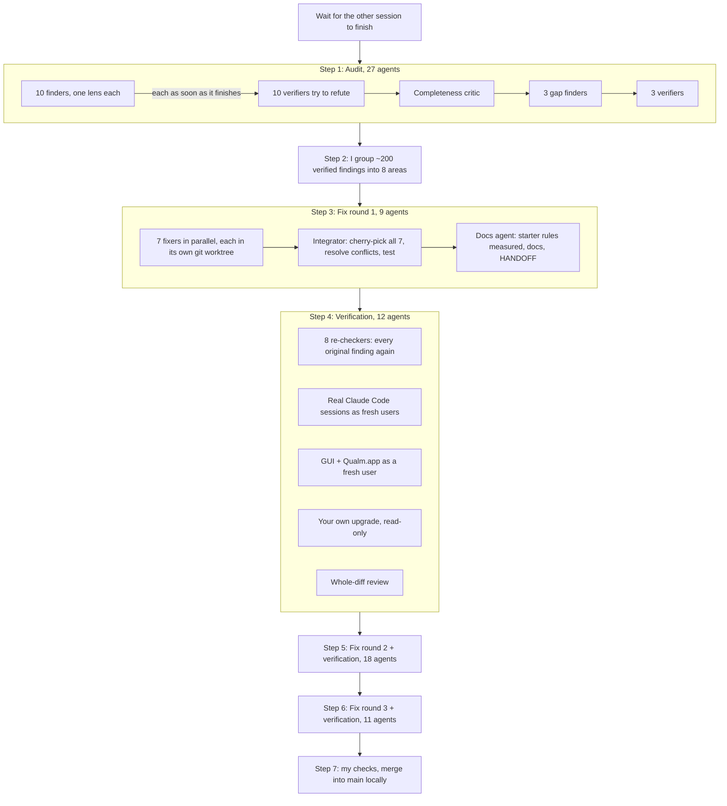

# How the fresh-user audit ran (night of 2026-09-23)

You asked for two things, after another Claude session in this folder had finished:
find the weaknesses left in Qualm and what keeps it from working beyond your own Mac, and
make sure a fresh user can use it both ways: through the GUI (Qualm.app, the setup window, the
menu bar, the pop-ups, the dashboard) and through Claude Code driving the `qualm` command. You
asked for "ultracode", which means: do the work with many AI agents in parallel, organised by a
script, and check every result adversarially before trusting it.

This document explains what that looked like: which agents ran, what each was told to do, how
they worked together, what every step produced, and why it took all night.

## The short version

- **Both paths work for a fresh user**, verified at the end on the merged code:
  - *Claude Code / CLI*: install from a clone, set up, add, test, tune and undo rules, plan a
    weekend pause, ask "why did it pop up" and "how was my week". Real headless Claude Code
    sessions started from the menu's own prompt followed the guide, made the right changes,
    never invented numbers, and answered a German user in German.
  - *GUI*: Qualm.app builds and signs; the setup window, the menu in every state, the key
    window and the pop-ups render cleanly (checked as images, light and dark, with long and
    Chinese text); the dashboard works empty and with data, at laptop and narrow widths.
- **What the audit found**: 204 problems (2 critical, 31 high), from parallel edits that
  could empty `rules.toml` and an unpinned model that would force a 16 GB rebuild, to a setup
  window that a first CLI command switched off, hosted users told their screens stay on the
  Mac, and starter rules written around the author's own sites.
- **What was done**: three rounds of fixes, each checked by agents that hadn't written them.
  By the end, nearly every finding was fixed; about 40 small items stay open (edge
  cases and polish, none critical or high), listed in HANDOFF.md under "Still open".
  Tests went from 125 to 411.
- **Where it is**: merged into `main` locally as one commit (`0ff9a1d`); not pushed.
  Your running Qualm is still the old code until you restart it (below).
- **The cost**: 77 agents over about 10 hours of wall-clock time, about 21 million tokens,
  about 9,700 tool calls. Nothing was shown on your screen after the one Firefox mistake at
  the start (see below).

## Words used here

- **Agent.** One Claude instance with a task, its own context and its own tools (a terminal,
  file reading and editing). It works alone until it returns a result. Agents don't talk to
  each other.
- **Orchestrator.** Me, the main Claude session you talked to. I planned the work, wrote the
  scripts that started the agents, read their results, and decided the next step.
- **Workflow.** A small JavaScript program I wrote that starts agents and passes results
  between them: "run these 10 in parallel; when one finishes, start a checker on its result".
  The script, not an agent, decides what runs when, so the order is predictable.
- **Structured result.** Each agent had to return its answer in a fixed shape (a JSON schema:
  a list of findings, each with a title, severity, steps to reproduce, the evidence seen, the
  files involved and a suggested fix). That's what let the next step read it without guessing.
- **Pipeline vs. barrier.** In a pipeline, each item moves to its next stage as soon as it's
  ready (a finder's results go to their checker right away). A barrier waits for all of a
  stage to finish first; it's only used when the next step needs everything at once (merging
  all the fixes).
- **Verifier.** An agent whose job is to try to prove another agent wrong: reproduce each
  finding from scratch, and call it "refuted" if it can't. A finding survived only if an
  independent agent could reproduce it.
- **Completeness critic.** An agent that reads what everyone covered and asks "what did nobody
  test?", then proposes extra audits for the gaps.
- **Git worktree.** A second working copy of the same repository in another folder, on its own
  branch. Seven agents could edit the code at the same time without stepping on each other,
  because each had its own worktree.
- **Commit / branch / cherry-pick.** Each fixing agent saved its work as one commit on its own
  branch. Integration then copied ("cherry-picked") those seven commits one by one onto a
  single branch, resolving the places where two agents had changed the same lines.

## How they collaborated

Agents never messaged each other. Everything went through three channels:

1. **The workflow script** handed one step's structured results to the next step's prompts
   (a finder's findings became its verifier's input; the fixers' reports became the
   integrator's input).
2. **Files on disk** under `/tmp/qualm-audit/`: the clean copy of the code everyone tested,
   the findings grouped per area (`fix/<area>.json`), the fix reports, the verification
   results.
3. **Git**: each fixer's branch, the integration branch built from them, the docs branch on
   top.



## Timeline

| Time (local) | Step | Agents | Took |
|---|---|---|---|
| 21:06 | You asked; the other session (`qualm-71`) was still busy | - | - |
| 21:10 | It committed `896abd8` and went idle; I ran the tests as a baseline | - | 4 min |
| 21:14 | Audit, first try | 10 | stopped after ~7 min (see "The Firefox incident") |
| 21:23 | Audit, restarted with background-only rules | 27 | 1 h 43 min |
| 23:06 | I grouped the findings into 8 areas | - | 7 min |
| 23:13 | Fix round 1: 7 fixers, integration, docs | 9 | 2 h 29 min |
| 01:45 | Verification | 12 | 35 min |
| 02:21 | I grouped the ~110 new problems into areas again | - | 4 min |
| 02:25 | Fix round 2 + integration + docs + verification | 18 | 2 h 23 min |
| 04:49 | Fix round 3 (the last medium problems) + verification | 11 | 2 h 10 min |
| 07:00 | My own checks, the merge into main, Qualm.app rebuilt, this document | - | ~20 min |

## Step 0: waiting for the other session

Another Claude session was fixing bugs in the same folder. Two sessions editing one checkout
would overwrite each other, so I polled it every few minutes. At 21:09 it committed
`896abd8` ("Rules change through your AI agent…") and went idle, with nothing left
uncommitted. Everything below starts from that commit.

The baseline test run already showed the first problem: the test suite only passed when run
from inside the checkout (9 tests looked for `rules.example.toml` relative to the current
folder).

## Step 1: the audit (27 agents)

**Setup.** I cloned the code into `/tmp/qualm-audit/qualm`, so agents tested exactly what a
fresh user would download, never your working copy. Every agent got the same rules
(the "safety preamble"): its own empty Qualm home (`QUALM_HOME`), never your real data, never
your keychain or login items, never your running app or its model server, at most a few dozen
spaced-out calls to that server, and nothing on your screen.

**Ten finders, each with one lens:**

| Lens | What that agent did | Findings (after checking) |
|---|---|---|
| cli:install | Installed from a fresh clone and followed the README literally; every command and `--help`; setup with and without a terminal | 20 (15 confirmed, 5 partly) |
| claude-code:day0 | Played Claude Code for a brand-new user, knowing only `qualm guide`, through 11 requests (English and Chinese); ran one real headless `claude -p` in a fresh checkout | 16 |
| claude-code:week1 | The same for a user one week in (made-up history): "why did it pop up", allow classes, tuning, bulk edits | 19 (2 refuted) |
| gui:setup+app | Rendered every setup page off-screen in every state; built Qualm.app from scratch and ran its CLI | 17 |
| gui:menu+panels | Built the real menu and every pop-up off-screen, clicked through them in code, with long, Chinese and right-to-left text | 16 |
| gui:dashboard | Served the dashboard on its own port; every tab in headless Chrome, light and dark, empty and with data; the API and its security guard | 16 |
| core:generalization | Code review with fake inputs: other browsers, other languages, schedules, non-browser apps, the starter rules | 14 (1 refuted) |
| model:generalization | 40 made-up pages the author never tried, through the real local model and hosted Jev | 9 |
| core:robustness | Tried to break the CLI and config the way users and agents do: bad input, hand edits, parallel edits, old files, a 200,000-line log | 19 |
| docs:claims | Ran every command and checked every claim in the README, docs, skill and guide | 19 |

**Ten verifiers.** As each finder finished, a verifier started on its findings with the
instruction to refute them: reproduce each one from scratch in its own empty home, read the
code, and mark it confirmed, partly right, or refuted. Only 3 of 204 were refuted, but 52 were
"partly": the verifier corrected the cause, the scope or the severity (for example, a claimed
"high" that only mattered on a setup nobody has).

**The critic and three gap audits.** The critic read everything covered and found three gaps
nobody had exercised end to end: a whole day of the running app (`gui:running-day`: the real
controller and watcher loop, off-screen), real Claude Code sessions from the menu's prompt
(`claude-code:real-agent`), and the local model's first start (`local-model:first-start`:
downloads, failures, retries). Each got its own finder and verifier.

**Result:** 204 findings: 149 confirmed, 52 partly, 3 refuted. After verification: 2 critical,
31 high, 91 medium, 77 low. Many were the same problem seen through different lenses (seven
agents independently found that `rules test` reported 0 hits for check-in rules).

The two critical ones: parallel CLI edits could lose changes and even empty `rules.toml`; and
the local model's checkpoint wasn't pinned, so any upstream change would make every user
rebuild it in full precision (a 16 GB memory peak).

**What already worked**, confirmed in the same pass: a fresh clone installs and runs; setup,
rules, focus and pause work from the CLI; a real headless Claude Code found the skill and
answered correctly; Qualm.app builds and its setup pages render cleanly and write what was
chosen; the menu, pop-ups and check-ins behave as designed off-screen; every dashboard tab
renders with no errors and its security guard held against every forged request tried.

### The Firefox incident

In the first try, I had allowed one agent to open a harmless page in Firefox to see what
Qualm reads from it. It did, on your screen, while you were working. You stopped the run:
"You should not be affecting my normal working… testing in the back would be good enough."

I stopped the workflow, closed that Firefox, and restarted everything with stricter rules:
nothing may open, come to the front, or take the keyboard or mouse; UI is checked by drawing
windows into image files that are never shown; the dashboard is checked in headless Chrome
(no window). None of the first run's agents had finished, so nothing was lost but time.

I also ran a small watcher process beside the agents that stopped and alerted me if it saw a
browser window, Qualm.app's GUI, input-sending AppleScript, a screen capture, a second model
server, or your app disappearing. It raised a few false alarms early on (Chrome's background
helpers, your own Qualm taking its usual screenshot, your own Cmd-Shift-4), which I fixed in
its filter; after that it ran for the rest of the night with no alerts.

## Step 2: grouping the findings (me)

Fixing 200 findings one by one would take days, and two agents fixing the same file at the same
time would collide. So I grouped them by the code they touch, into 7 code areas plus docs,
and wrote each area's findings to its own file with the decisions to apply where a finding
was a design question (for example: "undo becomes a stack of the last 20 versions"; "a new
rule counts the whole page, not only content inside feeds"; "setup never turns on start at
login from a script").

| Area | Files | Findings |
|---|---|---|
| config | config.py, rules.py, paths.py | 21 |
| policy | policy.py, watcher.py, state.py, ocr.py | 18 |
| trial | trial.py, the `rules test/tune`, `except`, `review` commands | 31 |
| cli | setup.py, doctor.py, autostart.py, agent.py, cli.py, status/pause | 51 |
| localmodel | localmodel.py, kevserve.py, the app's model server | 21 |
| gui | app.py, ui.py, onboard.py | 23 |
| dashboard | review.py, dashboard.html | 18 |
| docs | starter rules, README, docs, skill/guide, HANDOFF | 19 |

## Step 3: fix round 1 (9 agents)

**Seven fixers in parallel**, each in its own git worktree on its own branch, each told to fix
root causes with small changes, add tests, re-run every finding's reproduction to show before
and after, and end with exactly one commit.

| Area | Fixed | Not fixed (with reason) | Tests after |
|---|---|---|---|
| config | 22 | 5 | 159 pass |
| policy | 18 | 4 | 155 pass |
| trial | 30 | 1 | 135 pass |
| cli | 51 | 8 | 154 pass |
| localmodel | 21 | 5 | 147 pass |
| gui | 22 | 3 | 141 pass |
| dashboard | 18 | 4 | 136 pass |

Most "not fixed" items were outside an area's files (a fixer may not edit another area's
file beyond a tiny hunk), and were picked up later.

**The integrator** built one branch from the seven commits, in a fixed order, resolving 18
conflicts where two areas had changed the same functions (for example, the config area and
the policy area both changed how rules are validated; it kept one and adapted the other's
callers). It ran all tests after each step, added 7 small fixes that only showed up once the
pieces were together, and ran 17 smoke checks (a fresh user on the CLI, the setup window
still appearing after a CLI command, the GUI off-screen, the dashboard in headless Chrome).
284 tests passed.

**The docs agent** then reworded the starter rules so they fit anyone, not only the author's
sites, measuring every change on the model before keeping it (for example, the "videos" rule
no longer names Bilibili or YouTube: Netflix went from 0.13 to 0.64 on the local model and
entertainment video on other sites went from 3 to 8 of 9 caught, with no new false pop-ups on
lectures, docs or search), and brought the README, docs, skill, guide and HANDOFF in line
with the new code. 288 tests.

After round 1: 10 commits, 47 files changed (+8,647 / −1,639 lines). The end of round 1 is
commit `4dfd1a1` on the branch `fresh-user-audit-history`.

## Step 4: verification (12 agents)

Nothing was merged yet. Twelve new agents, none of which had written the fixes, checked them:

- **8 re-checkers**, one per area: every original finding re-run against the fixed code.
  Result over all findings: **216 fixed, 46 partly, 5 declined by design (the verifier agreed),
  3 couldn't be tested, 2 not fixed.**
- **Real Claude Code as fresh users** (`e2e:claude-code`): seven headless `claude -p` sessions
  started from the menu's own prompt, in English, and one in German, on day 0 and one week
  in, with the model behind a small rate-limiting proxy so your model server wasn't flooded.
  They followed the guide, made the right changes, never invented numbers, and the German one
  answered in German.
- **The GUI as a fresh user** (`e2e:gui`): Qualm.app rebuilt from the fixed code; every setup
  page, menu state, window and pop-up rendered and inspected; the one-copy-at-a-time lock
  confirmed.
- **Your own upgrade, read-only** (`e2e:user-upgrade`): the new code finds your rules and data
  in Application Support, won't show setup again, loads your `rules.toml` unchanged, and would
  start your saved 8-bit model with no new download.
- **A whole-diff review** (`e2e:diff-review`) for problems between areas: no deadlocks, the
  dashboard still escapes every page title, new endpoints are behind the guard, downloads are
  checked before use.

They also found about 110 new or leftover problems, mostly small, including 2 high: HANDOFF
told you to open the old, pre-audit `dist/Qualm.app`; and a `rules.toml` that doesn't load
still stopped the app from starting, which the stricter checks made more likely.

## Step 5: fix round 2 and its verification (18 agents)

I grouped those ~110 problems by area again and ran the same shape once more, this time
starting from the round-1 branch, with the verification built into the same workflow:

| Time | What | Result |
|---|---|---|
| 02:25-03:06 | 7 fixers in parallel (worktrees off the end of round 1) | 112 fixed, 19 left with reasons |
| 03:06-03:39 | Integrator | 10 conflicts resolved, 7 integration fixes (e.g. the app now falls back to the version Qualm *last saved* when rules.toml is broken, not the one before it), 359 tests |
| 03:40-04:16 | Docs agent | Facebook's and Instagram's login pages no longer get a feeds pop-up when the model is down; Kick's own pages aren't channels; HANDOFF explains how to switch from the running app |
| 04:17-04:48 | 9 verifiers (one per area, plus a fresh-user smoke on both paths with a real Claude Code session) | 130 fixed, 19 partly, 1 declined, 1 not fixed; 48 new problems, none critical or high |

The main round-2 changes, in plain words: a broken rules.toml no longer stops the app (it
starts on the last saved version and says what's wrong); the new app refuses to start while
your older copy is running; "Take me back" checks the browser is really in front before every
keystroke and leaves web apps (Slack, installed web apps) alone; a rule that names an app no
longer silences the model for the other rules there; `rules test` follows the app's model
server if it had to move ports; a pause can be planned ("this weekend" no longer pauses the
week); `review --json` can find the pop-ups the menu's prompt names.

## Step 6: fix round 3 and its verification (11 agents)

Round 2's verification found no critical or high problems, only ~14 medium ones among 48, and
each round was turning up fewer and smaller things. I ran one last, smaller round aimed at the
medium ones, with 4 fixers instead of 7:

| Time | What | Result |
|---|---|---|
| 04:50-05:39 | 4 fixers (core: config + CLI; policy; trial; surface: GUI, dashboard, local model) | 50 fixed, 17 left with reasons |
| 05:39-06:03 | Integrator | 411 tests |
| 06:03-06:26 | Docs agent | HANDOFF's section now covers all three rounds, with one list of what's still open |
| 06:26-07:00 | 5 verifiers (one per fixer, plus a final fresh-user smoke on both paths) | 66 fixed, 4 partly, 2 declined; 12 new problems, all low except one medium edge case (a rule on spotify.com doesn't step in on Spotify's web player, which the music class lists) |

Round 3's fixes that matter most to you: on your own home (which has no backup history yet),
the first `config undo` after a broken hand edit no longer throws away your last saved change;
starting on a broken rules.toml never reads apps you listed as never-to-read; "next week off"
asked on a Thursday no longer pauses Thursday and Friday; "Take me back" keeps every tab in
browsers Qualm doesn't list; search results pages are exempt, as the docs always promised.

The final smoke agent also checked your real home again, read-only: with the new code, paths
resolve to Application Support, no setup window, your rules.toml loads, and the local model
starts from your saved copy with no download.

## Step 7: the merge (me)

I ran the whole test suite myself from a temp folder (411 passed), checked the diff for
anything personal (nothing: no screen titles, no paths from your data), and merged into
`main` as **one commit** (`0ff9a1d`), because your rule is one commit per unit of work with
follow-up fixes folded in, and rounds 2 and 3 are follow-ups to round 1. The 25 separate
commits, one per area and round with what each fixed and why, are kept on the branch
`fresh-user-audit-history`. I removed the 27 temporary worktrees and the intermediate
branches, and rebuilt `dist/Qualm.app` and `dist/Qualm.dmg` from the merged code (not
opened). Nothing was pushed.

## Why it took all night

- **Size.** Five workflows: 27 + 9 + 12 + 18 + 11 = 77 agents (plus 10 in the stopped first
  try), about 21 million tokens and 9,700 tool calls between them. The final change touches
  51 files (+14,000 / -1,900 lines, much of it tests).
- **Order.** Fixing can't start before the audit ends, integration can't start before the
  slowest fixer ends (the cli area had 51 findings), and verification can't start before
  integration and docs end.
- **Your Mac's memory.** It was deep in swap all night. Every process the agents started competed with your apps. Your own Qualm's readings slowed
  from about 2 s to 8-14 s while the first audit shared its model server.
- **Deliberate throttling.** Calls to your model server were spaced at least 2 s apart and
  capped, because your running app shares it and it answers one request at a time; anything
  visual was drawn off-screen rather than shown.

## What you should do now

1. **Quit the running Qualm** from its menu bar icon (Quit). It's the old code in memory; the
   checkout was updated under it, so until it restarts some menu items or the dashboard may
   fail (its watching loop is safe). Don't run `qualm` commands or an agent against your rules
   before quitting it: the old app can't read some keys the new commands write.
2. In the checkout: `uv sync`, then start it again the way you did before:

   ```bash
   uv run qualm app
   ```

   `uv run qualm status` should then say "app: running". The model server on 8009 can keep
   running.
3. Optional: open the rebuilt `dist/Qualm.app` instead (quit the checkout's copy first) and
   allow "Qualm" under System Settings > Privacy & Security > Accessibility.
4. Then try the things no agent could touch from the background: "Take me back" in Chrome,
   Safari and Firefox; the menu's warning line (turn Accessibility off and on); a second
   `qualm app` refusing to start. HANDOFF.md's "Next steps" lists them all.

## Where the material is

- The code changes: `git show 0ff9a1d` on `main` (one commit), or
  `git log 896abd8..fresh-user-audit-history` for the 25 commits behind it, one per area and
  round, each saying what it fixed and why.
- HANDOFF.md's newest dated section: the same story, for the next session.
- Workflow scripts and every agent's full transcript: in that Claude Code session's project
  folder (`workflows/scripts/` and `subagents/workflows/`).
- Raw results in `/tmp/qualm-audit/` (`result.json` = audit, `fixresult.json` = round 1,
  `verifyresult.json` = its verification, `round2result.json` and `round3result.json` = the
  later rounds with their verifications). `/tmp` is cleared when the Mac restarts.
